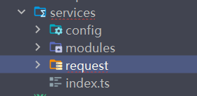

## 要做的事

- 对于==**全局拦截器**==，每个请求都会被拦截
  - 直接添加方法即可做到
- 对于==**实例拦截器**==，当设置不同的hyRequest请求实例时，可以给该实例传递拦截函数
  - 在实例中添加
- 对于==**单次请求拦截器**==，可以针对于每一个单独的请求，设置拦截器
  - 达到更精细的控制


## 基本封装的思想

- 在==**config/index.ts文件**==中，主要用来==**写请求的基本路径以及请求的超时时间和区分开发环境的**==
- 在==modules文件夹==中，主要用来==**保存各个页面封装好的网络请求**==
  - 比如有一个login页面，那么在modules文件夹中，就可以有一个modules/login.ts文件，用来封装网络请求
  - **用的时候，可以在store中进行调用，也可以在页面中**
- 在==request文件夹==中，主要用来==**保存二次封装的axios**==
- 在==services/index.ts==文件中，主要用来==**统一导出实例**==

- 

### 代码

- ==services/config/index.ts==

  - 主要用来**<u>写请求的基本路径以及请求的超时时间</u>**，**<u>区分开发环境</u>**

  - ```ts
    let BASE_URL = ''
    if (import.meta.env.PROD) {
      // 生产环境
      BASE_URL = 'http://codercba.com:5000'
    } else {
      // 开发环境
      BASE_URL = 'http://codercba.com:5000'
    }
    export const TIME_OUT = 10000
    export { BASE_URL }
    ```

- ==services/index.ts==

  - 主要用来**<u>统一导出实例</u>**

  - ```tsx
    import HYRequest from "./request";
    import {BASE_URL,TIME_OUT} from "./config";
    
    const hyRequest = new HYRequest({
        baseURL:BASE_URL,
        timeOut:TIME_OUT
    });
    
    export default hyRequest;
    ```

- ==**services/request/index.ts（重点）**==

  - 主要用来**<u>保存二次封装的axios</u>**

  - ```tsx
    import axios from "axios";
    import type { AxiosInstance,AxiosRequestConfig } from "axios";
    
    // HYRequest类封装了Axios的请求功能
    class HYRequest {
        // 请求实例的封装
        instance:AxiosInstance
        
        // 将传入的配置对象创建成一个axios实例
        constructor(config:AxiosRequestConfig) {
            this.instance = axios.create(config)
        }
        
        // 网络请求方法的封装
        request(config:AxiosRequestConfig) {
            return this.instance.request(config)
        }
        // 请求方法的核心功能在request方法中实现
        // 这里只需要将传递的参数传递过去即可
        get(config:AxiosRequestConfig){
            return this.request({...config,method:'GET'})
        }
        
        post(config:AxiosRequestConfig){
            return this.request({...config,method:'POST'})
        }
    }
    export default HYRequest;
    ```

    

## 全局拦截器

- ==**直接添加方法即可**==
  
  - this.instance.interceptors.request.use() //请求拦截器
  - this.instance.interceptors.response.use() //响应拦截器
  
- ==**services/request/index.ts（重点）**==

  - ```tsx
    import axios from "axios";
    import type { AxiosInstance,AxiosRequestConfig } from "axios";
    class HYRequest {
    
        // 请求实例的封装
        instance:AxiosInstance
        constructor(config:AxiosRequestConfig) {
            this.instance = axios.create(config)
    /**
     * 全局拦截器
     * 就是直接使用方法，即可
     * this.instance.interceptors.request.use()
     * this.instance.interceptors.response.use()
     * */
            // 给每个instance实例都添加拦截器（全局拦截器）
            this.instance.interceptors.request.use(
                (config) => {
                    // loading/token
                    return config
                },
                (err) => {
                    return err
                }
            )
            
            this.instance.interceptors.response.use(
                (res) => {
                    return res.data
                },
                (err) => {
                    return err
                }
            )
        }
    
        // 网络请求方法的封装
        request(config:AxiosRequestConfig) {
            return this.instance.request(config)
        }
    
        get(){}
    
        post(){}
    }
    
    export default HYRequest;
    ```

## 实例拦截器

- ==**拦截器可以添加多个**==

- 实例拦截器的思想就是，**<u>在new实例传递配置对象时，多传递一个拦截函数即可</u>**

  - ```tsx
    import HYRequest from "./request";
    import {BASE_URL} from "./config";
    
    const hyRequest2 = new HYRequest({
        baseURL:BASE_URL,
        // 多传递的拦截函数
        interceptors:{
            requestSuccessFn(config) {
                return config;
            },
            requestFailFn(err) {
                return err;
            },
            responseSuccessFn(res) {
                return res;
            },
            responseFailFn(err) {
                return err;
            },
        }
    });
    ```

- ==**自定义一个接口HYRequestConfig，用来扩展AxiosRequestConfig**==

  - ```tsx
    interface HYRequestConfig extends AxiosRequestConfig{
    	// 这里将interceptors定义的对象，拆分到了下面的接口中
        interceptors?: HYInterceptors
    }
    
    interface HYInterceptors {
        requestSuccessFn?:(config:AxiosRequestConfig) => AxiosRequestConfig
        requestFailFn?:(err:any) => any
        responseSuccessFn?:(res:AxiosResponse)=>AxiosResponse
        responseFailFn?:(err:any)=>any
    }
    ```

- ==**services/request/index.ts（重点）**==

  - ```tsx
    import axios from "axios";
    import type { AxiosInstance,AxiosRequestConfig } from "axios";
    
    
    class HYRequest {
    
        // 请求实例的封装
        instance:AxiosInstance
        
        constructor(config:HYRequestConfig) {
            this.instance = axios.create(config)
            // 拦截器可以添加多个
            // 给每个instance实例都添加拦截器（全局拦截器）
            this.instance.interceptors.request.use(
                (config) => {
                    // loading/token
                    return config
                },
                (err) => {
                    return err
                }
            )
            this.instance.interceptors.response.use(
                (res) => {
                    return res.data
                },
                (err) => {
                    return err
                }
            )
            
            /**
             * 新增
             * 实例请求拦截器的思想
             * 在外部使用的时候，传递配置对象时，多传递一个拦截函数即可
             * */
    
            this.instance.interceptors.request.use(
                config.interceptors?.requestSuccessFn,
                config.interceptors?.requestFailFn
            )
            this.instance.interceptors.response.use(
                config.interceptors?.responseSuccessFn,
                config.interceptors?.responseFailFn
            )
    
        }
    
        // 网络请求方法的封装
        request(config:AxiosRequestConfig) {
            return this.instance.request(config)
        }
    
        get(){}
    
        post(){}
    }
    
    export default HYRequest;
    ```

## 单次请求拦截器

- 针对单次的请求拦截，操作逻辑放入到request请求方法中

  - ==**services/request/index.ts（重点）**==

  - ```tsx
    // 网络请求方法的封装
    	// 这里参数的类型，使用HYRequestConfig类型，该类型扩展了AxiosRequestConfig
        request(config:HYRequestConfig) {
            // 针对单次请求的拦截
            if(config.interceptors?.requestSuccessFn){
                config = config.interceptors.requestFailFn(config)
            }
            return new Promise((resolve, reject) => {
                this.instance.request(config).then(res=>{
                    if(config.interceptors?.responseSuccessFn){
                        res = config.interceptors.responseSuccessFn(res)
                    }
                    resolve(res)
                }).catch(err=>{
                    reject(err)
                })
            })
        }
    ```

- 使用方式

  - ```tsx
    import hyRequest from "@/services"
    
    // 针对单次的请求
    hyRequest.get({
        url:"xxx",
        interceptors:{
            requestSuccessFn:(config)=>{
                return config
            }
            responseSuccessFn:(res) => {
        		return res
    		}
        }
    })
    ```


## 完整代码

```tsx
import axios from "axios";
import type { AxiosInstance,AxiosRequestConfig,AxiosResponse } from "axios";


interface HYRequestConfig extends AxiosRequestConfig{
    // 这里将interceptors定义的对象，拆分到了下面的接口中
    interceptors?: HYInterceptors
}

interface HYInterceptors {
    requestSuccessFn?:(config:AxiosRequestConfig) =>  AxiosRequestConfig
    requestFailFn?:(err:any) => any
    responseSuccessFn?:(res:AxiosResponse) => AxiosResponse
    responseFailFn?:(err:any)=>any
}


class HYRequest{
    instance: AxiosInstance;

    constructor(config: HYRequestConfig){
        this.instance = axios.create(config)
        // 给每个instance实例都添加拦截器（全局拦截器）
        this.instance.interceptors.request.use(
            (config) => {
                // loading/token
                return config
            },
            (err) => {
                return err
            }
        )
        this.instance.interceptors.response.use(
            (res) => {
                return res.data
            },
            (err) => {
                return err
            }
        )

        // 实例拦截器
        this.instance.interceptors.request.use(
            config.interceptors?.requestSuccessFn,
            config.interceptors?.requestFailFn
        )
        this.instance.interceptors.response.use(
            config.interceptors?.responseSuccessFn,
            config.interceptors?.responseFailFn
        )
    }

    request(config:HYRequestConfig){
        // 针对单次请求的拦截
        // 在发送请求之前，判断有没有传递interceptors
        if(config.interceptors?.requestSuccessFn){
            config = config.interceptors.requestSuccessFn(config)
        }
        return new Promise((resolve, reject) => {
            this.instance.request(config).then(res=>{
                // 在响应成功，返回数据前，判断有没有多传递interceptors
                if(config.interceptors?.responseSuccessFn){
                    res = config.interceptors.responseSuccessFn(res)
                }
                resolve(res)
            }).catch(err=>{
                reject(err)
            })
        })
    }

    get(config:HYRequestConfig){
        return this.request({...config,method:"GET"})
    }


    post(config:HYRequestConfig){
        return this.request({...config,method:"POST"})
    }
}

export default HYRequest;
```

